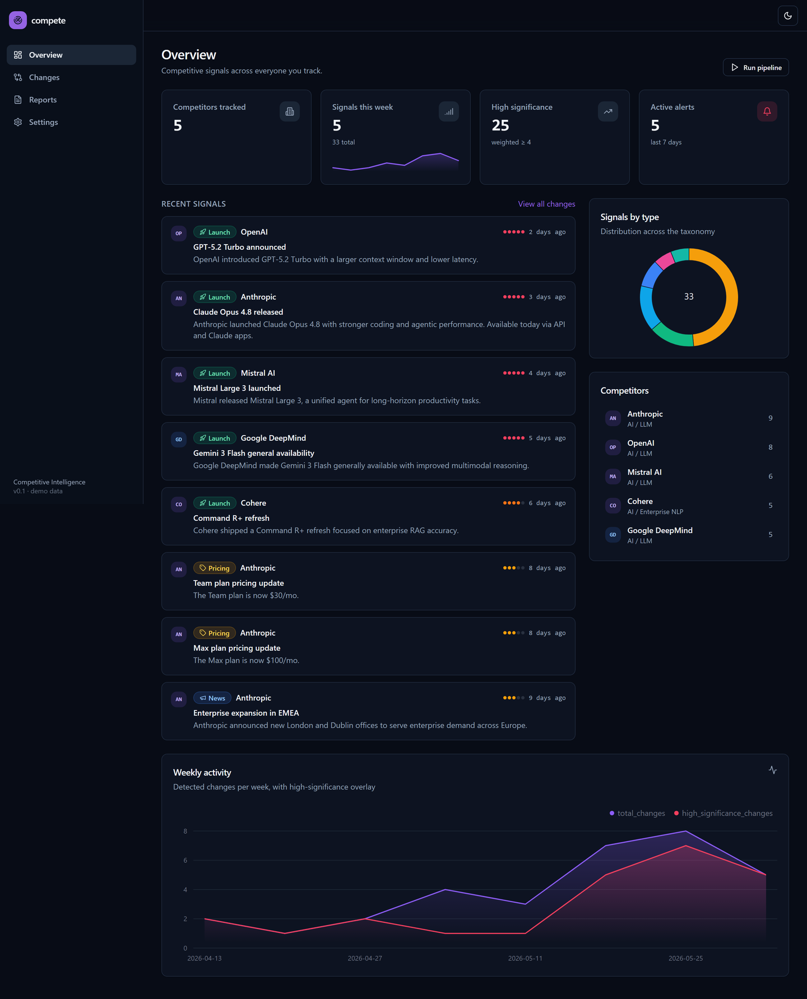
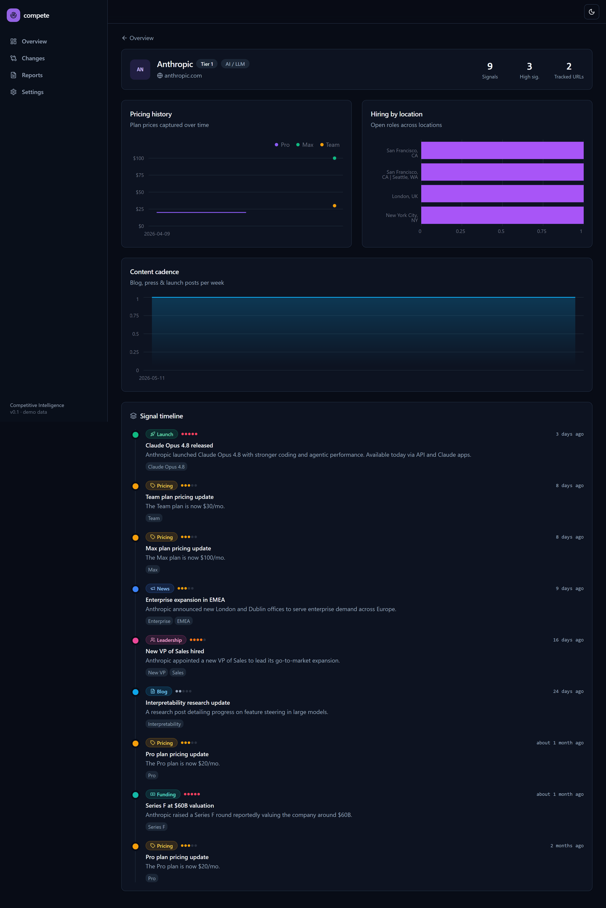
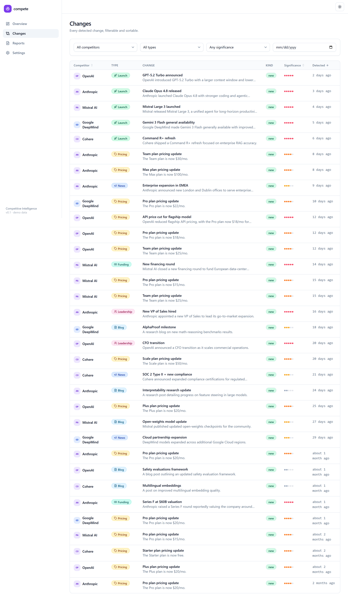
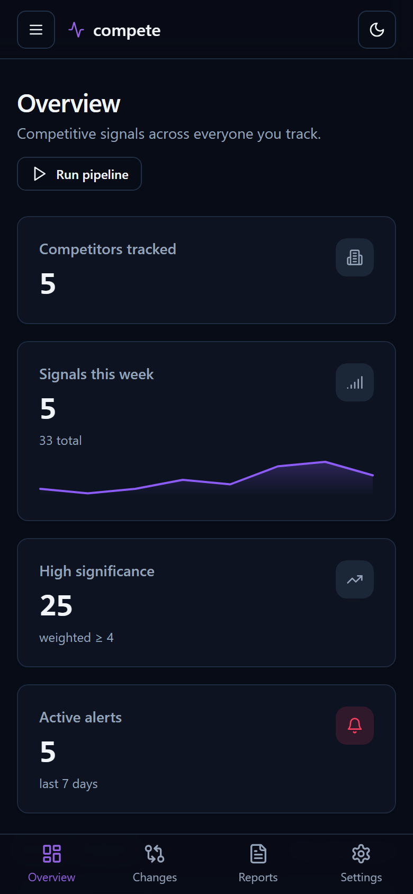

# compete - Competitive Intelligence Platform

Scheduled agents monitor a configurable list of competitors (websites, blogs,
pricing pages, news, job postings), extract **structured signals** with an LLM,
warehouse everything in **DuckDB**, detect meaningful changes, and serve a
polished, responsive dashboard with auto-generated weekly reports.

> Status: **complete** - config-driven collection (static/dynamic/RSS/jobs),
> snapshot-diff change detection, provider-agnostic LLM extraction, a dbt
> warehouse (staging → marts + tests), a typed FastAPI, a polished responsive
> Next.js dashboard (light/dark), weekly markdown→PDF reports, and optional
> Slack/email alerts. Runs end-to-end on free/local tooling.

## Screenshots

| Overview (dark) | Competitor detail (dark) |
|---|---|
|  |  |

| Changes (light) | Mobile (dark) |
|---|---|
|  |  |

More in [`docs/screenshots/`](docs/screenshots/) (reports, settings, light/dark).

## Tech stack

| Layer        | Tooling |
|--------------|---------|
| Collection   | Python, httpx + selectolax, trafilatura, Playwright, feedparser |
| LLM extraction | provider-agnostic (Gemini Flash default · Groq · Ollama · mock), `instructor` structured outputs |
| Storage      | DuckDB (file-based warehouse) + Parquet raw layer |
| Transform    | dbt-core + dbt-duckdb (staging → marts, tests, docs) |
| API          | FastAPI (typed, OpenAPI) |
| Frontend     | Next.js + TypeScript + Tailwind + shadcn/ui + Tremor |

Optimized for **free / open-source** tooling throughout.

## Quickstart

Requires [`uv`](https://docs.astral.sh/uv/) (handles Python 3.12 automatically).

```bash
# 1. Install dependencies into a local venv (all extras for the full demo)
uv sync --extra dev --extra dbt --extra api --extra report

# 2. Configure environment
cp .env.example .env            # Windows: copy .env.example .env

# 3. Initialize the warehouse + mirror competitor config
uv run compete init-db
uv run compete sync-competitors

# 4. Collect (fetch tracked URLs → store snapshots), then inspect
uv run compete collect
uv run compete status

# 5. Run the test suite
uv run pytest
```

No LLM key is needed for Phases 0-1. Extraction (Phase 2) uses Gemini Flash by
default; set `GOOGLE_API_KEY` in `.env`, or switch `COMPETE_LLM_PROVIDER` to
`groq` / `ollama` / `mock`.

## One-command demo (no keys)

Seed curated, realistic data (5 competitors, signals across all types, pricing
history, hiring, weekly reports), build the marts, and start **both** the API
and the dashboard - no API key or live scraping required:

```bash
uv run python scripts/demo.py        # or: make demo
```

Then open **http://localhost:3000** (dashboard) and **http://127.0.0.1:8000/docs**
(API). The script runs `npm install` for the web app on first use.

Prefer the pieces separately:

```bash
uv run python scripts/seed_demo.py --build   # seed + build marts
uv run compete-api                            # API on :8000
cd web && npm install && npm run dev          # dashboard on :3000
```

Key endpoints: `GET /stats/overview`, `GET /signals`, `GET /changes`,
`GET /competitors`, `GET /competitors/{id}/pricing-history|hiring|cadence`,
`GET /reports`, `GET /reports/{id}/pdf`, `POST /pipeline/run`.

## Run the real pipeline

```bash
uv run compete run-all                 # sync → collect → extract → dbt → report
uv run compete run-all -p mock -n 5    # offline (mock LLM), capped for a quick demo
```

Set `GOOGLE_API_KEY` (Gemini, default) or switch `COMPETE_LLM_PROVIDER` to
`groq` / `ollama` / `mock`. No key is needed for collection or the `mock` path.

## Add a competitor

Edit `config/competitors.yaml` - no code changes required:

```yaml
competitors:
  - id: example
    name: Example Inc
    domain: example.com
    industry: SaaS
    tier: 1
    tracked_urls:
      - url: https://example.com/blog
        source_type: static      # static | dynamic | rss | jobs
        signal_hint: blog_post
```

Then `uv run compete sync-competitors && uv run compete collect -c example`.

## Repository layout

```
pipeline/    collect · extract (llm + embeddings) · detect · report · storage · transform · cli
warehouse/   dbt project (staging → marts, tests, docs)
api/         FastAPI app
web/         Next.js dashboard
config/      competitors.yaml (config-driven)
scripts/     demo · seed_demo · screenshots · inspect_marts
docs/        ARCHITECTURE · DATA_MODEL · AGENTS · RUNBOOK · DEPLOYMENT · adr/
```

## Scraping ethics

Public pages only; honors `robots.txt` (including `Crawl-delay`) by default;
polite per-host throttling; honest User-Agent; never scrapes behind logins.

## Free-tier cost

| Component | Service | Cost |
|-----------|---------|------|
| Pipeline schedule | GitHub Actions cron | Free |
| LLM extraction | Gemini Flash / Groq free tier · Ollama/`mock` local | $0 |
| Embeddings | local hashing (default) or MiniLM | $0 |
| Warehouse | DuckDB + Parquet (file) | $0 |
| API host | Oracle Always Free VM / Fly.io | $0 |
| Dashboard | Vercel Hobby | $0 |

**$0** with default/local providers. See [DEPLOYMENT](docs/DEPLOYMENT.md).

## Documentation

- [ARCHITECTURE](docs/ARCHITECTURE.md) - system diagram, data flow, component responsibilities
- [DATA_MODEL](docs/DATA_MODEL.md) - every table, lineage, dbt docs
- [AGENTS](docs/AGENTS.md) - extraction schema, prompt, retry loop, providers, cost controls
- [RUNBOOK](docs/RUNBOOK.md) - add a competitor, backfill, fix a scraper, rate limits
- [DEPLOYMENT](docs/DEPLOYMENT.md) - GitHub Actions, Vercel, API host, env/secrets
- [ADRs](docs/adr/) - DuckDB vs Postgres · snapshot-diffing · deterministic pipeline
- [CONTRIBUTING](CONTRIBUTING.md) - setup and quality gates

## License

Released under the [MIT License](LICENSE).
