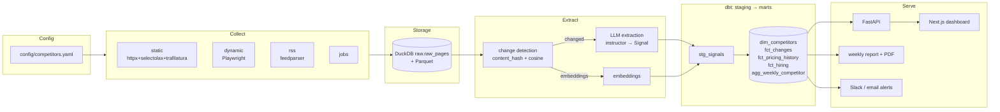

# Architecture

`compete` is a **deterministic pipeline with narrow LLM extraction nodes** - not
an autonomous free-roaming agent. Every stage is independently runnable,
debuggable, and cheap. The only "agentic" behaviour is structured extraction
with a validation-retry loop (see [AGENTS.md](./AGENTS.md)).

## System diagram

## Data flow

1. **Collect** - for each tracked URL in `competitors.yaml`, the matching
   collector fetches the public page (robots-respecting, throttled), extracts
   clean text, computes a `content_hash`, and writes a snapshot to
   `raw.raw_pages` (DuckDB) / Parquet.
2. **Detect (cheap, pre-LLM)** - compare the new `content_hash` to the previous
   snapshot. Unchanged → stop. Changed → compute embedding cosine similarity;
   high similarity (minor edit) → skip; low → it's a real change.
3. **Extract (LLM)** - only real changes are sent to the LLM, which returns a
   validated `Signal` (via `instructor`). Validation failure retries once with
   the error fed back. All calls logged with token counts for cost tracking.
4. **Warehouse (dbt)** - `staging` cleans/normalizes; `marts` build the
   dimensional model and the `agg_weekly_competitor` rollup. `dbt test` enforces
   data quality.
5. **Serve** - FastAPI reads the marts; the Next.js dashboard renders them;
   the report node produces a weekly markdown brief (→ PDF); alerts fire on
   high-significance changes.

## Component responsibilities

| Component | Responsibility | Why |
|-----------|----------------|-----|
| `pipeline/collect` | Fetch public pages politely; produce `RawPage` | Isolated, swappable per source type |
| `pipeline/storage` | Own the raw layer + DuckDB connection | Single writer; dbt only reads |
| `pipeline/detect` | Hash + embedding diff; gate the LLM | Minimizes LLM spend |
| `pipeline/extract` | `instructor`-enforced `Signal` + retry | Reliability over autonomy |
| `pipeline/llm` | Provider-agnostic client (Gemini/Groq/Ollama/mock) | Swap providers via env |
| `warehouse/dbt` | staging → marts, tests, docs | Declarative, testable transforms |
| `api` | Typed read API over marts + CRUD over config | Clean contract for the frontend |
| `web` | The dashboard (the product surface) | Where most quality effort goes |

## Key design decisions

See [`adr/`](./adr/):
- **0001** - DuckDB over Postgres for the warehouse.
- **0002** - Snapshot-diffing (hash + embedding) over naive re-extraction.
- **0003** - Deterministic pipeline over an autonomous agent.

Rationale summary: cost control, reproducibility, and debuggability. The LLM is
used surgically (extract structure from already-known-changed content), never to
decide *what* to do.
